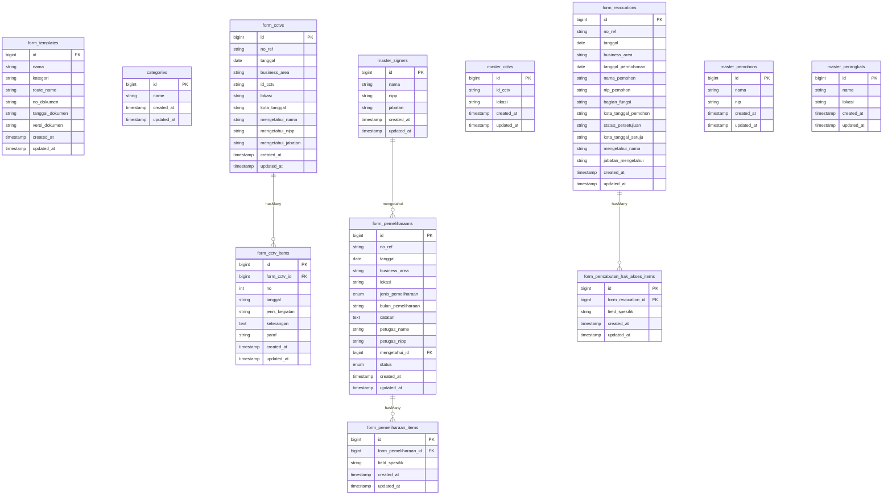

# System Design — Formulir KAI

> Dokumen ini adalah panduan desain sistem (**system design**) untuk project **Formulir KAI**.
> Setiap developer **wajib** mengikuti konvensi yang tertulis di sini agar pengembangan tetap konsisten.

---

## 1. Informasi Umum Project

| Item | Detail |
|---|---|
| **Framework** | Laravel 13.x (PHP ≥ 8.3) |
| **Database** | MySQL (`formulir-kai`) |
| **CSS Framework** | Tailwind CSS v4 (via `@tailwindcss/vite`) |
| **JS Interaktif** | Alpine.js (CDN) |
| **Select / Dropdown** | Tom Select (CDN) |
| **Alert / Dialog** | SweetAlert2 (CDN) |
| **Smooth Scroll** | Lenis |
| **Excel Import/Export** | `maatwebsite/excel` v3.1 |
| **PDF Export** | `barryvdh/laravel-dompdf` v3.1 |
| **Build Tool** | Vite 8 + `laravel-vite-plugin` |
| **Font** | Inter (Google Fonts, via CDN) + Instrument Sans (Bunny via Vite) |

---

## 2. Arsitektur & Struktur Folder

Project ini mengikuti arsitektur **MVC (Model-View-Controller)** standar Laravel dengan pengelompokan **per-modul formulir** (domain-based grouping).

```
formulir-kai/
├── app/
│   ├── Exports/
│   │   ├── FormCctv/                    # Export classes untuk modul CCTV
│   │   ├── FormPemeliharaan/            # Export classes untuk modul Pemeliharaan
│   │   └── FormPencabutanHakAkses/      # Export classes untuk modul Pencabutan Hak Akses
│   ├── Http/
│   │   └── Controllers/
│   │       ├── Controller.php           # Base controller
│   │       ├── CategoryController.php   # Controller kategori
│   │       ├── FormTemplateController.php
│   │       ├── FormCctv/                # Controllers modul CCTV
│   │       ├── FormPemeliharaan/        # Controllers modul Pemeliharaan
│   │       └── FormPencabutanHakAkses/  # Controllers modul Pencabutan Hak Akses
│   ├── Imports/
│   │   ├── FormCctv/                    # Import classes untuk modul CCTV
│   │   ├── FormPemeliharaan/            # Import classes untuk modul Pemeliharaan
│   │   └── FormPencabutanHakAkses/      # Import classes untuk modul Pencabutan Hak Akses
│   ├── Models/
│   │   ├── Category.php                 # Model global
│   │   ├── FormTemplate.php             # Model global (registry formulir)
│   │   ├── User.php                     # Model global
│   │   ├── FormCctv/                    # Models modul CCTV
│   │   ├── FormPemeliharaan/            # Models modul Pemeliharaan
│   │   └── FormPencabutanHakAkses/      # Models modul Pencabutan Hak Akses
│   └── Providers/
│       └── AppServiceProvider.php
├── database/
│   └── migrations/
├── resources/
│   ├── css/
│   │   └── app.css                      # Tailwind + custom styles (TomSelect theme)
│   ├── js/
│   │   └── app.js
│   └── views/
│       ├── layouts/
│       │   └── app.blade.php            # Master layout (sidebar + header + content)
│       ├── components/
│       │   └── custom-datepicker.blade.php
│       ├── dashboard.blade.php
│       ├── formulir.blade.php           # Katalog semua formulir
│       ├── form-cctv/                   # Views modul CCTV
│       ├── form-pemeliharaan/           # Views modul Pemeliharaan
│       └── form-pencabutan-hak-akses/   # Views modul Pencabutan Hak Akses
├── routes/
│   ├── web.php                          # Semua route web
│   └── console.php
└── config/
```

---

## 3. Konvensi Penamaan (Naming Convention)

### 3.1 Database / Migration

| Elemen | Format | Contoh |
|---|---|---|
| **Tabel utama (form)** | `form_{nama_modul}s` (snake_case, plural) | `form_cctvs`, `form_pemeliharaans` |
| **Tabel detail/items** | `form_{nama_modul}_items` | `form_cctv_items`, `form_pemeliharaan_items` |
| **Tabel master data** | `master_{nama_entitas}s` | `master_cctvs`, `master_signers`, `master_perangkats` |
| **Kolom foreign key** | `{tabel_singular}_id` | `form_cctv_id`, `mengetahui_id` |
| **Kolom tanggal** | `tanggal` (bukan `date`) | `tanggal`, `tanggal_permohonan` |
| **File migration** | `{timestamp}_create_{nama_tabel}_table.php` | `2026_07_01_031010_create_form_cctvs_table.php` |
| **File migration (alter)** | `{timestamp}_add_{kolom}_to_{nama_tabel}_table.php` | `2026_07_01_041423_add_kota_tanggal_to_form_cctvs_table.php` |

**Pola umum kolom pada tabel `form_*`:**
```
id, no_ref, tanggal, business_area, ...(kolom spesifik)..., 
mengetahui_nama/mengetahui_id, status (opsional), timestamps
```

### 3.2 Model (Eloquent)

| Elemen | Format | Contoh |
|---|---|---|
| **Namespace** | `App\Models\{NamaModul}` | `App\Models\FormCctv` |
| **Nama class** | PascalCase singular | `FormCctv`, `FormCctvItem`, `MasterSigner` |
| **Lokasi file** | `app/Models/{NamaModul}/` | `app/Models/FormCctv/FormCctv.php` |
| **Relasi parent → items** | method `items()` → `hasMany(...)` | `$this->hasMany(FormCctvItem::class)` |
| **Relasi item → parent** | method `form{Modul}()` → `belongsTo(...)` | `$this->belongsTo(FormCctv::class)` |
| **Relasi ke master signer** | method `mengetahui()` → `belongsTo(MasterSigner::class, 'mengetahui_id')` | — |

**Pola umum pada model `Form*`:**
- Selalu gunakan `$fillable` (bukan `$guarded`).
- Gunakan **mutator** `setTanggalAttribute` dan **accessor** `getTanggalAttribute` untuk konversi format tanggal (`dd-mm-yyyy` ↔ `yyyy-mm-dd`).
- Jika formulir memiliki status workflow, tambahkan helper method seperti `isDraft()`, `isDicetak()`, `isSelesai()` dan computed attribute `getStatusBadgeAttribute()` / `getStatusLabelAttribute()`.

### 3.3 Controller

| Elemen | Format | Contoh |
|---|---|---|
| **Namespace** | `App\Http\Controllers\{NamaModul}` | `App\Http\Controllers\FormCctv` |
| **Nama class** | PascalCase + `Controller` | `FormCctvController`, `MasterCctvController` |
| **Lokasi file** | `app/Http/Controllers/{NamaModul}/` | `app/Http/Controllers/FormCctv/FormCctvController.php` |

**Setiap modul formulir memiliki 2 jenis controller:**
1. **FormController** — CRUD utama untuk formulir (resource controller: `index`, `create`, `store`, `show`, `edit`, `update`, `destroy`).
2. **MasterController** — CRUD + Import untuk master data pendukung (`store`, `update`, `destroy`, `import`, `downloadTemplate`).

### 3.4 Route

| Elemen | Format | Contoh |
|---|---|---|
| **URL formulir** | `form-{nama-modul}` (kebab-case) | `/form-cctv`, `/form-pemeliharaan` |
| **URL master data** | `master-{nama-entitas}` | `/master-cctv`, `/master-signer` |
| **Route name formulir** | `form-{nama-modul}.{action}` | `form-cctv.index`, `form-cctv.create` |
| **Route name master** | `master-{nama-entitas}.{action}` | `master-cctv.import`, `master-cctv.template` |

**Pola registrasi di `routes/web.php`:**
```php
// ==============================================================
// ROUTES FORMULIR {NAMA MODUL}
// ==============================================================
// Route custom (jika ada) diletakkan SEBELUM resource route
Route::resource('form-{nama-modul}', Form{NamaModul}Controller::class);

// Master Data
Route::post('master-{entitas}/import', [Master{Entitas}Controller::class, 'import'])->name('master-{entitas}.import');
Route::get('master-{entitas}/template', [Master{Entitas}Controller::class, 'downloadTemplate'])->name('master-{entitas}.template');
Route::resource('master-{entitas}', Master{Entitas}Controller::class)->only(['store', 'update', 'destroy']);
```

### 3.5 View (Blade)

| Elemen | Format | Contoh |
|---|---|---|
| **Folder** | `resources/views/form-{nama-modul}/` (kebab-case) | `form-cctv/`, `form-pemeliharaan/` |
| **File index** | `index.blade.php` | Daftar data + tabel master data |
| **File create** | `create.blade.php` | Wrapper yang include `form.blade.php` |
| **File edit** | `edit.blade.php` | Wrapper yang include `form.blade.php` |
| **File form** | `form.blade.php` | Komponen form utama (dipakai create & edit) |
| **File show** | `show.blade.php` | Tampilan detail / preview cetak |

**Pola pada `create.blade.php`:**
```blade
@extends('layouts.app')
@section('title', 'Buat Formulir {Nama Modul}')
@section('back_button')
<a href="{{ route('form-{modul}.index') }}" class="...">
    <svg ...>←</svg>
</a>
@endsection
@section('content')
    @include('form-{modul}.form', ['isEdit' => false])
@endsection
```

### 3.6 Export & Import (Maatwebsite/Excel)

| Elemen | Format | Contoh |
|---|---|---|
| **Namespace Export** | `App\Exports\{NamaModul}` | `App\Exports\FormCctv` |
| **Namespace Import** | `App\Imports\{NamaModul}` | `App\Imports\FormCctv` |
| **Nama class Export** | `{Entitas}TemplateExport` | `FormCctvItemTemplateExport`, `MasterCctvTemplateExport` |
| **Nama class Import** | `{Entitas}Import` | `FormCctvItemImport`, `MasterCctvImport` |

---

## 4. Pola Desain (Design Patterns)

### 4.1 Pola Master-Detail (Header + Items)

Setiap formulir menggunakan pola **1 tabel header + 1 tabel detail**:

```
form_{modul}s (header)    ←→    form_{modul}_items (detail)
     1          :          N     (hasMany / belongsTo)
```

- Tabel header menyimpan informasi umum: `no_ref`, `tanggal`, `business_area`, `mengetahui_*`, dsb.
- Tabel detail menyimpan baris-baris isi formulir (dinamis, bisa ditambah/kurang).
- Saat **update**, items lama dihapus dan dibuat ulang (`$form->items()->delete()` lalu create baru).

### 4.2 Pola Master Data

Setiap modul dapat memiliki **master data** pendukung untuk dropdown/autocomplete:

| Master Data | Tabel | Digunakan oleh |
|---|---|---|
| `MasterCctv` | `master_cctvs` | FormCctv (daftar ID & lokasi kamera) |
| `MasterSigner` | `master_signers` | FormCctv, FormPemeliharaan (penandatangan / mengetahui) |
| `MasterPemohon` | `master_pemohons` | FormPencabutanHakAkses (daftar pemohon) |
| `MasterPerangkat` | `master_perangkats` | FormPemeliharaan (daftar perangkat jaringan) |

Master data mendukung **import via Excel** dan **download template Excel**.

### 4.3 Pola FormTemplate (Registry)

Tabel `form_templates` berfungsi sebagai **registry/katalog** semua jenis formulir yang tersedia. Setiap formulir baru **wajib** didaftarkan di tabel ini (melalui migration seeder).

```php
// Contoh insert di migration
DB::table('form_templates')->insert([
    'nama'            => 'Nama Formulir',
    'kategori'        => 'Umum',         // Kategori: Umum, Public, dll
    'route_name'      => 'form-{modul}.index',
    'no_dokumen'      => 'FR.SM/TI/xxx/xx-xxxx',
    'tanggal_dokumen' => 'dd Bulan yyyy',
    'versi_dokumen'   => 'xxx-yyyy',
    'created_at'      => now(),
    'updated_at'      => now(),
]);
```

### 4.4 Pola Status Workflow (Opsional)

Beberapa formulir memiliki alur status:

```
draft → dicetak → selesai
```

Kolom `status` bertipe `ENUM('draft', 'dicetak', 'selesai')` dengan default `'draft'`.
Model menyediakan helper:
- `isDraft()`, `isDicetak()`, `isSelesai()` — boolean check
- `getStatusBadgeAttribute()` — return Tailwind CSS class untuk badge
- `getStatusLabelAttribute()` — return label human-readable

---

## 5. UI / Frontend Design System

### 5.1 Layout

Menggunakan **master layout** tunggal di `layouts/app.blade.php` dengan pola:

```
┌──────────────────────────────────────────┐
│  Sidebar (collapsible)  │  Main Content  │
│  ┌──────────────────┐   │  ┌──────────┐  │
│  │ Logo + Toggle     │   │  │ Header   │  │
│  │ Nav Links         │   │  │ @yield   │  │
│  │  - Dashboard      │   │  │ (title)  │  │
│  │  - Formulir       │   │  ├──────────┤  │
│  │                   │   │  │ Content  │  │
│  │                   │   │  │ @yield   │  │
│  │                   │   │  │(content) │  │
│  │ User Profile      │   │  │          │  │
│  └──────────────────┘   │  └──────────┘  │
└──────────────────────────────────────────┘
```

**Blade sections yang tersedia:**
- `@yield('title')` — judul halaman di header
- `@yield('back_button')` — tombol kembali (opsional)
- `@yield('content')` — konten utama halaman
- `@yield('scripts')` — script tambahan per halaman

### 5.2 Warna & Styling

| Elemen | Warna / Style |
|---|---|
| **Background utama** | `#FAFBFF` (light blue-gray) |
| **Sidebar** | `bg-white`, border right `border-gray-200` |
| **Nav active** | `bg-blue-50 text-blue-700` |
| **Nav hover** | `hover:bg-gray-50 hover:text-gray-900` |
| **Card** | `bg-white rounded-xl shadow-sm border border-gray-100` |
| **Card hover** | `hover:shadow-md transition-shadow` |
| **Primary color** | Blue (`blue-600`, `blue-700`) |
| **Success badge** | `bg-green-100 text-green-800` |
| **Warning badge** | `bg-yellow-100 text-yellow-800` |
| **Info badge** | `bg-blue-100 text-blue-800` |
| **Font** | Inter (`font-family: 'Inter', sans-serif`) |

### 5.3 Komponen Form

- **Input/Select** pada form menggunakan style TomSelect yang sudah di-custom di `app.css` (class `modern-select`).
- **Date picker** menggunakan komponen custom `components/custom-datepicker.blade.php`.
- **Dynamic rows** (item/detail) dikelola dengan JavaScript vanilla (Add Row / Remove Row).
- **Validasi dialog** menggunakan SweetAlert2.
- **Interaksi UI** (show/hide, toggle) menggunakan Alpine.js (`x-data`, `x-show`, `@click`, dsb).

---

## 6. Alur Data (CRUD Flow)

### 6.1 Create

```
User membuka /form-{modul}/create
  → Controller::create() memuat master data untuk dropdown
  → View create.blade.php di-render (include form.blade.php)
  → User mengisi form + menambah dynamic rows
  → POST ke /form-{modul}
  → Controller::store() memvalidasi & menyimpan header + items
  → Redirect ke index dengan flash message success
```

### 6.2 Update

```
User membuka /form-{modul}/{id}/edit
  → Controller::edit() memuat form + items yang ada
  → View edit.blade.php di-render (include form.blade.php dengan data existing)
  → User mengedit form
  → PUT ke /form-{modul}/{id}
  → Controller::update() memvalidasi, update header, DELETE items lama, CREATE items baru
  → Redirect ke index dengan flash message success
```

### 6.3 Delete

```
User klik hapus di index → SweetAlert2 konfirmasi
  → DELETE ke /form-{modul}/{id}
  → Controller::destroy() menghapus form (items otomatis cascade)
  → Redirect ke index dengan flash message success
```

---

## 7. Panduan Menambah Modul Formulir Baru

Berikut langkah-langkah **checklist** untuk menambah modul formulir baru (misal: `FormAvailability`):

### 7.1 Backend (Developer A)

1. **Migration tabel header:**
   - File: `database/migrations/{timestamp}_create_form_availabilities_table.php`
   - Kolom wajib: `id`, `no_ref`, `tanggal`, `business_area`, `timestamps`
   - Kolom spesifik sesuai formulir

2. **Migration tabel detail:**
   - File: `database/migrations/{timestamp}_create_form_availability_items_table.php`
   - FK: `form_availability_id` → `form_availabilities` (cascade delete)

3. **Migration seed `form_templates`:**
   - Tambahkan entry baru ke tabel `form_templates` di migration terpisah atau seeder

4. **Model header:**
   - File: `app/Models/FormAvailability/FormAvailability.php`
   - Namespace: `App\Models\FormAvailability`
   - Isi: `$fillable`, mutator tanggal, relasi `items()`

5. **Model detail:**
   - File: `app/Models/FormAvailability/FormAvailabilityItem.php`
   - Namespace: `App\Models\FormAvailability`
   - Isi: `$fillable`, relasi `formAvailability()`

6. **Model master data (jika diperlukan):**
   - File: `app/Models/FormAvailability/Master{Entitas}.php`

7. **Controller form:**
   - File: `app/Http/Controllers/FormAvailability/FormAvailabilityController.php`
   - Method: `index`, `create`, `store`, `show`, `edit`, `update`, `destroy`

8. **Controller master (jika ada):**
   - File: `app/Http/Controllers/FormAvailability/Master{Entitas}Controller.php`
   - Method: `store`, `update`, `destroy`, `import`, `downloadTemplate`

9. **Export/Import (jika diperlukan):**
   - `app/Exports/FormAvailability/{Entitas}TemplateExport.php`
   - `app/Imports/FormAvailability/{Entitas}Import.php`

### 7.2 Frontend (Developer B)

10. **Route:**
    - Tambahkan di `routes/web.php` di blok baru dengan komentar separator
    - Gunakan `Route::resource('form-availability', FormAvailabilityController::class)`

11. **Views:**
    - `resources/views/form-availability/index.blade.php`
    - `resources/views/form-availability/create.blade.php`
    - `resources/views/form-availability/edit.blade.php`
    - `resources/views/form-availability/form.blade.php`
    - `resources/views/form-availability/show.blade.php`

12. **Update dashboard:**
    - Tambahkan query count baru di route `/` (dashboard)
    - Tambahkan concat baru ke `$recentForms` collection

13. **Update sidebar (jika perlu):**
    - Tambahkan navigation link baru di `layouts/app.blade.php`

---

## 8. Dependency & Package Registry

### 8.1 PHP (Composer)

| Package | Versi | Fungsi |
|---|---|---|
| `laravel/framework` | ^13.8 | Framework utama |
| `laravel/tinker` | ^3.0 | REPL untuk debugging |
| `maatwebsite/excel` | ^3.1 | Import/export Excel |
| `barryvdh/laravel-dompdf` | ^3.1 | Export PDF |

### 8.2 Node.js (npm)

| Package | Versi | Fungsi |
|---|---|---|
| `vite` | ^8.0.0 | Build tool |
| `laravel-vite-plugin` | ^3.1 | Integrasi Vite + Laravel |
| `tailwindcss` | ^4.0.0 | CSS framework |
| `@tailwindcss/vite` | ^4.0.0 | Plugin Tailwind untuk Vite |
| `concurrently` | ^9.2.3 | Menjalankan `php artisan serve` + `npm run dev` bersamaan |

### 8.3 CDN (diload di `layouts/app.blade.php`)

| Library | Versi | Fungsi |
|---|---|---|
| Alpine.js | 3.x | Reactive UI (toggle, show/hide, x-data) |
| Tom Select | 2.2.2 | Enhanced select/dropdown/autocomplete |
| SweetAlert2 | 11 | Dialog konfirmasi & notifikasi |
| Lenis | 1.0.45 | Smooth scrolling |

---

## 9. Environment & Konfigurasi

| Key | Nilai (Development) | Keterangan |
|---|---|---|
| `DB_CONNECTION` | `mysql` | Database engine |
| `DB_DATABASE` | `formulir-kai` | Nama database |
| `SESSION_DRIVER` | `database` | Session via database |
| `QUEUE_CONNECTION` | `database` | Queue via database |
| `CACHE_STORE` | `database` | Cache via database |
| `MAIL_MAILER` | `log` | Email ke log (development). Ganti `smtp` untuk production. |

**Cara menjalankan development server:**
```bash
npm start
# Menjalankan: concurrently "php artisan serve" "npm run dev"
```

---

## 10. ERD (Entity Relationship Diagram)



---

## 11. Catatan Penting

1. **Jangan gunakan `$guarded`** — selalu gunakan `$fillable` pada model.
2. **Cascade delete** — selalu set `onDelete('cascade')` pada FK dari tabel items ke tabel header.
3. **Flash message** — gunakan `->with('success', '...')` pada redirect setelah CRUD berhasil. View menanganinya lewat SweetAlert2.
4. **Pagination** — gunakan `->paginate()` pada index. Jika ada beberapa tabel dalam satu halaman, bedakan nama page parameter (contoh: `'form_page'`, `'cctv_page'`).
5. **Validasi** — validasi di sisi server (controller) dengan `$request->validate()`. Client-side validation bersifat tambahan saja.
6. **Format tanggal** — simpan di database sebagai `Y-m-d`. Tampilkan ke user sebagai `d-m-Y` atau `dd Bulan YYYY` (via accessor pada model).
7. **Import Excel** — selalu sediakan `downloadTemplate()` untuk user mengunduh template kosong.
8. **Tambah modul baru** — wajib daftarkan ke tabel `form_templates` dan update logic dashboard.
